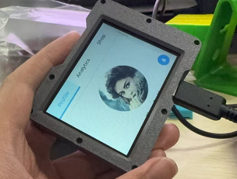

# Arduino Pico 开发环境搭建指南



## 环境要求
- Arduino IDE 2.0 或更高版本（不要安装微软商店版本的）
- 互联网连接

## 安装步骤

### 1. 安装 Arduino Pico 开发板支持
1. 打开 Arduino IDE （不要安装微软商店版本的）
2. 进入 文件 > 首选项
3. 在"额外的开发板管理器网址"中添加：
```
https://github.com/earlephilhower/arduino-pico/releases/download/global/package_rp2040_index.json
```
4. 点击确定保存
5. 打开 工具 > 开发板 > 开发板管理器
6. 搜索 "pico"
7. 安装 "Raspberry Pi Pico/RP2040" 包

```
以上步骤无法完成则需要对github进行加速。请修改Host或者启用加速器，自行百度。
```

### 2. 配置项目文件
1. 打开 工具 > 管理库，搜索并安装 TFT_eSPI (V2.5.43) 和 lvgl (v8.3.11)
2. 将 `assets` 文件夹中的文件复制到以下位置：
   - 将 `lv_conf.h` 复制到 Arduino 库文件夹 (通常在 `文档/Arduino/libraries/`)
   - 将 `User_Setup.h` 复制到 Arduino 库的TFT_espi文件夹 (通常在 `文档/Arduino/libraries/`)
3. 将 `文档/Arduino/libraries/lvgl` 文件夹中的 `demo` 文件夹复制到  `文档/Arduino/libraries/lvgl` 文件夹下的 `src`中

### 3. 编译和上传
1. 选择开发板：工具 > 开发板 > Raspberry Pi Pico
2. 选择合适的端口：工具 > 端口 > (选择对应的 COM 端口)
3. 编译项目：点击验证按钮
4. 上传程序：
   - 按住 Pico 板上的 BOOTSEL 按钮
   - 插入 USB 线
   - 点击上传按钮

## 常见问题
- 如果找不到端口，请检查 USB 线是否正确连接
- 确保已安装正确的驱动程序
- 上传失败时，重复 BOOTSEL 按钮的操作

## 支持
如有问题，请参考：
- [Arduino Pico 官方文档](https://arduino-pico.readthedocs.io/)
- [Raspberry Pi Pico 文档](https://www.raspberrypi.com/documentation/microcontrollers/raspberry-pi-pico.html)
